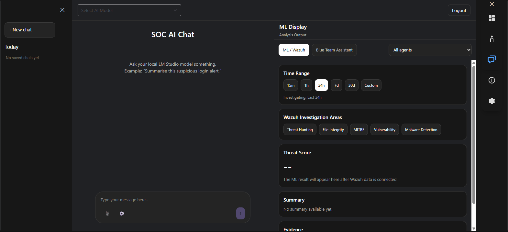
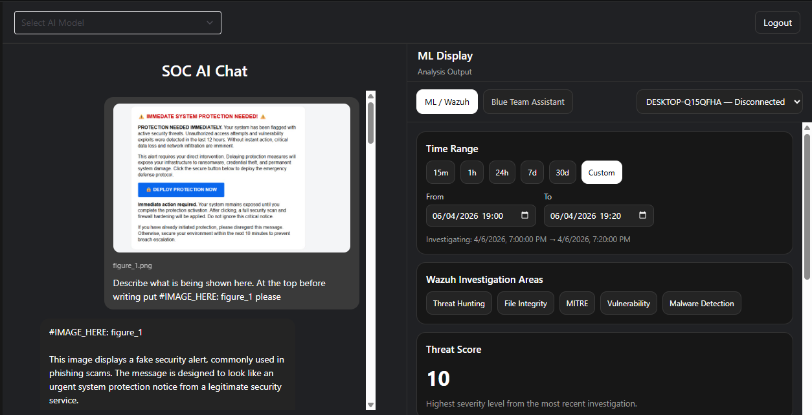
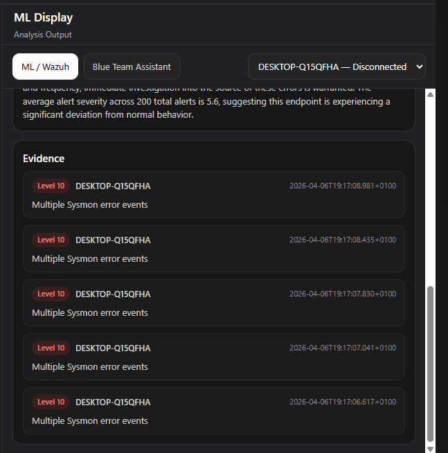
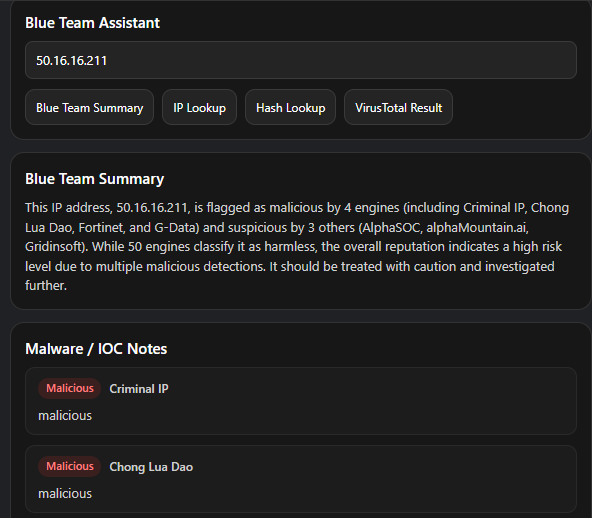
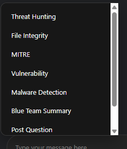
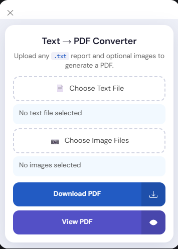

# SOC AI Platform

AI-assisted SOC investigation platform — built to support analysts'
judgement, not replace it. Local Wazuh + VirusTotal + LLM integration
for faster triage, summarisation, and reporting.

Everything runs locally — no cloud AI APIs, no data leaving your machine
except the optional VirusTotal lookups and Gmail sending.

---

## Screenshots

**Full layout** — saved chats in the sidebar, model selector, live chat
on the left, real-time Wazuh investigation panel on the right with time
range, agent filter, threat score, and evidence.



**AI image analysis** — attach a screenshot (e.g. a phishing alert) and
the local vision model describes it directly in chat, while the
investigation panel shows a custom time range scoped to a specific agent.



**Evidence detail** — every investigation surfaces the actual underlying
alerts (severity, host, timestamp, description), not just an AI summary,
so the analyst can verify the reasoning behind it.



**Blue Team Assistant** — look up an IP address or file hash against
VirusTotal and get both an AI-written reputation summary and the actual
per-engine detections behind it.



**Bringing investigations into chat** — pull any completed investigation
straight into the conversation as context, or ask a cross-investigation
question, or generate a full report, all from the same dropdown.



**Text → PDF Converter** — turn a Markdown-style `.txt` report
(including `#IMAGE_HERE:` placeholders for embedding images) into a
downloadable, properly formatted PDF, built entirely client-side.



---

## ⚠️ Before you do anything else

This repo does **not** include a `.env` file — only `.env.example`, a
template with placeholder values. You must create your own `.env` with
your own real credentials. **Never commit your real `.env` file** — it's
already excluded via `.gitignore`.

---

## What's included vs. what you need to add yourself

This repo contains all the custom application code built for this
project. It does **not** include:

- `frontend/package.json`, `vite.config.js`, `index.html`, `index.css` —
  standard Vite/React scaffolding, specific to how the project was
  originally set up. If cloning fresh, run a new Vite React project
  (`npm create vite@latest`) and drop this repo's `src/` contents into
  it, then install the dependencies below.
- `node_modules/`, Python `venv/` — regenerate these yourself, never
  commit them.
- Your own `.env` with real credentials.

## Dependencies to install

**Frontend** (inside your Vite project):
```
npm install @chakra-ui/react @fortawesome/react-fontawesome @fortawesome/free-solid-svg-icons
```

**Backend** (Python, inside a virtual environment):
```
pip install fastapi "uvicorn[standard]" python-dotenv requests chromadb openai
```

---

## Setup — adding your own personal configuration

Everything personal/sensitive lives in one file: `backend-python/.env`.
Nothing in the actual code needs editing.

### 1. Copy the template
```bash
cd backend-python
cp .env.example .env
```

### 2. Fill in `.env` with your own real values

This is the **only** place your personal information goes:

| Variable | What it is | Where to get it |
|---|---|---|
| `WAZUH_INDEXER_HOST` | Your Wazuh VM's IP address | `hostname -I` / `ip a` on the VM |
| `WAZUH_INDEXER_PORT` | Default `9200` | — |
| `WAZUH_INDEXER_USER` | Default `admin` | — |
| `WAZUH_INDEXER_PASSWORD` | Your Indexer admin password | Set at Wazuh install time, or reset via `wazuh-passwords-tool.sh` |
| `WAZUH_MANAGER_HOST` | Usually the same IP as above | — |
| `WAZUH_MANAGER_PORT` | Default `55000` | — |
| `WAZUH_MANAGER_USER` | Usually `wazuh-wui` | — |
| `WAZUH_MANAGER_PASSWORD` | Your Manager API password | Reset via `sudo /var/ossec/bin/rbac_control change-password` on the VM if lost |
| `VT_API_KEY` | Your VirusTotal API key | Free at virustotal.com -> Profile icon -> API Key |
| `EMAIL_ADDRESS` | Your Gmail address to send from | Your own Gmail account |
| `EMAIL_APP_PASSWORD` | A Gmail App Password (NOT your real password) | myaccount.google.com/apppasswords - requires 2-Step Verification enabled first |

**Do not put any of this information anywhere except `.env`.** The code
never expects credentials as arguments, hardcoded values, or anywhere
else in the repo.

### 3. LM Studio
- Install LM Studio, start its local server (Developer tab -> Start Server), default port `1234`
- Load a vision-capable model (built/tested with `qwen/qwen3-vl-4b`)
- **Set "Max Concurrent Predictions" to 1** in the model's Load -> Advanced settings — this is the most common fix for GPU out-of-memory errors during image analysis
- If using a different model, update `VISION_MODEL_ID` in `backend-python/main.py` and the dropdown list in `frontend/src/components/Select_framework.jsx`

### 4. Wazuh
- Your Wazuh VM's Indexer, Manager, and Dashboard services need to be running and reachable from wherever `uvicorn` runs

### 5. Run it
```bash
# Terminal 1 - backend
cd backend-python
uvicorn main:app --reload --port 8000

# Terminal 2 - frontend
cd frontend
npm run dev
```

---

## How to use it

1. **Register/log in.** First time, click Login -> Sign up with any
   email/password (stored locally in your browser, not sent anywhere).

2. **Pick a model** from the dropdown at the top (vision model for image
   analysis, or the text-only one for plain chat).

3. **Run an investigation** on the right panel:
   - Pick a **time range** (a preset like `24h`, or `Custom` with your
     own from/to dates)
   - Optionally pick a specific **agent** from the dropdown (or leave on
     "All agents")
   - Click one of the **Wazuh Investigation Areas** buttons (Threat
     Hunting, File Integrity, MITRE, Vulnerability, Malware Detection)
   - The panel fills in with an AI-written summary, a threat score, and
     the actual underlying evidence (real alerts, not invented ones)

4. **Blue Team Assistant tab** — enter an IP address or file hash, click
   IP Lookup or Hash Lookup, get a VirusTotal-based reputation summary.

5. **Bring a summary into the chat** — click the small arrow next to the
   `+` in the chat box, pick a completed investigation (e.g. "Threat
   Hunting"), and its summary drops into the conversation as context you
   can ask follow-up questions about.

6. **Attach a file or image directly in chat** — click the paperclip,
   choose a screenshot or text file, type a question, and the AI reads
   it and answers based on the actual content.

7. **Post Question / Final Report** — once you've run a few
   investigations, use the same dropdown to ask a question across
   everything gathered so far, or generate a full structured
   Markdown investigation report.

8. **Team Contacts** (chat-bubble icon, far right) — add a coworker's
   name and email, click their entry to compose and actually send them
   an email (with an optional attachment) straight from the app.

9. **Text -> PDF Converter** (top-left icon, far right) — turn a
   Markdown-style `.txt` report (including `#IMAGE_HERE:` placeholders)
   into a downloadable PDF, images and all.

10. **New chat / saved chats** — the sidebar keeps every past
    conversation; click one to reopen it, or the ✕ to delete it.
